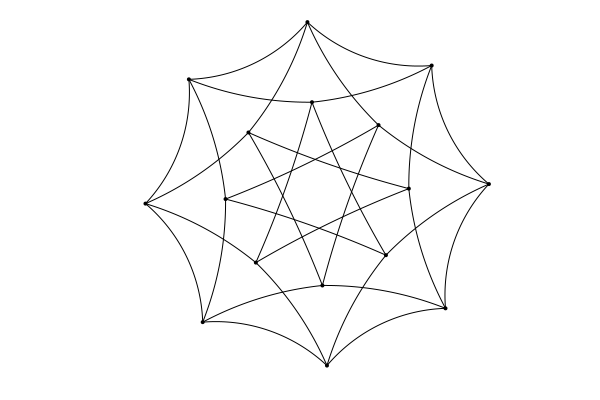

# `HyperbolicDrawSimpleGraphs`

This is a module for drawing graphs in the hyperbolic plane. It relies
on the `SimpleGraphs` and `HyperbolicPlane` modules. The modules rely,
in turn, on `Plots` and `SimpleDrawing`

## Functions

This module defines `hembed` and `hdraw`. The `hembed` function is used to
give a graph its embedding in the hyperbolic plane, and then `hdraw` is used
to render that drawing.

To create the embedding, one uses `hembed(G,method)` where `method` is
one of the following:
+ `:circular`: Place the vertices around a circle.
+ `:random`: Place the vertices randomly in the hyperbolic plane.
+ `:convert`: Convert the graph's Euclidean embedding into a
hyperbolic embedding (see **Conversion** below).

## Example

```
julia> using SimpleGraphs, HyperbolicDrawSimpleGraphs

julia> G = Cube(4)
Cube graph Q(4) (n=16, m=32)

julia> embed(G,:combined)

julia> hembed(G,:convert)

julia> hdraw(G)
```
produces this:



### Conversion from Euclidean Embedding 

The `:convert` method for `hembed` does the following.
+ For each vertex `v` of the graph, get its `x,y`-coordinates from
its Euclidean embedding.
+ Convert `x,y` to polar `(r,theta)`.
+ Embed `v` in the hyperbolic plane at `HPoint(r,theta)`.
